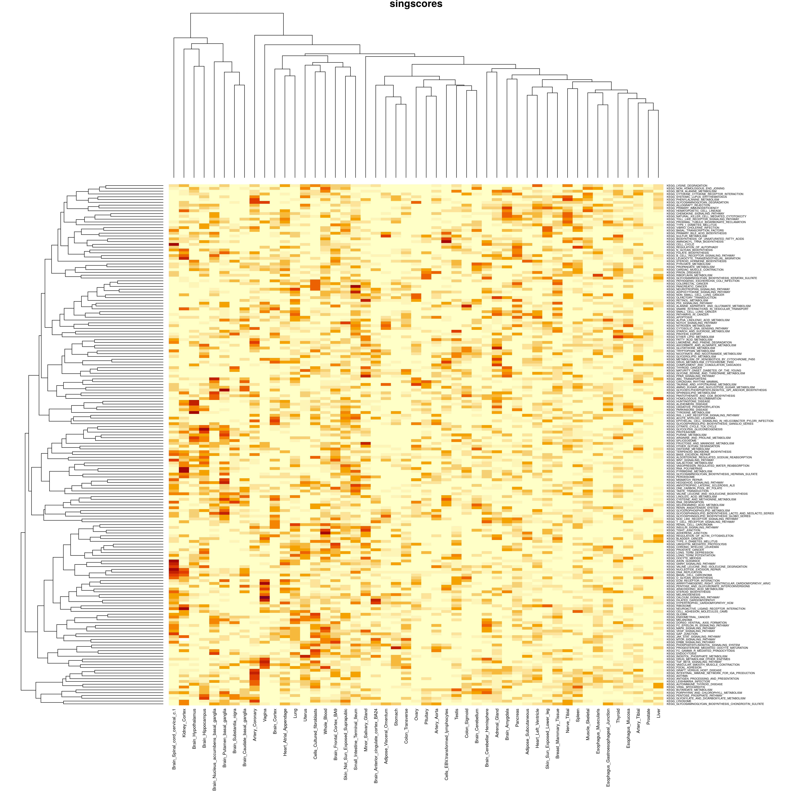
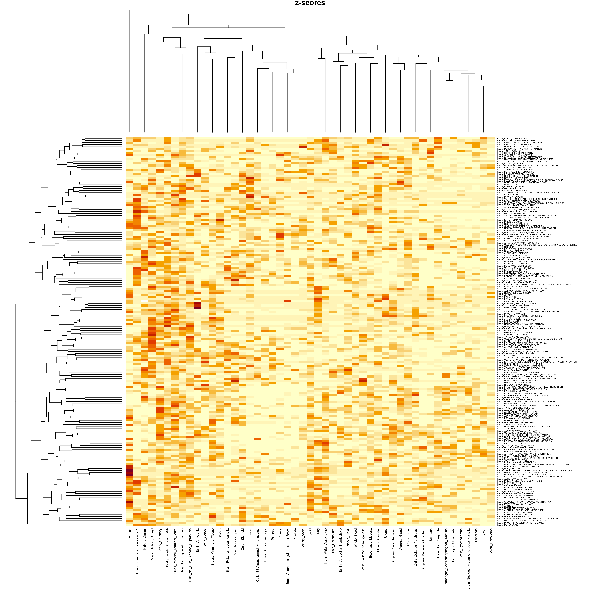
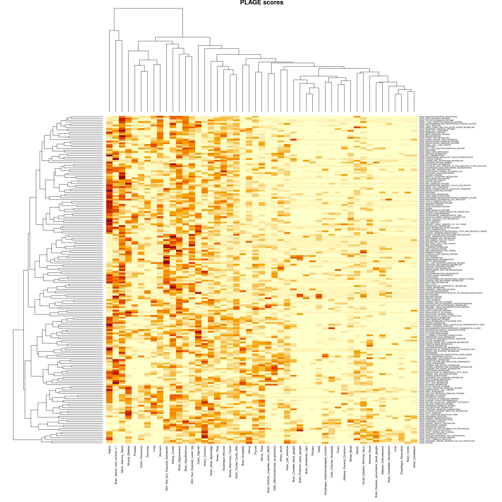
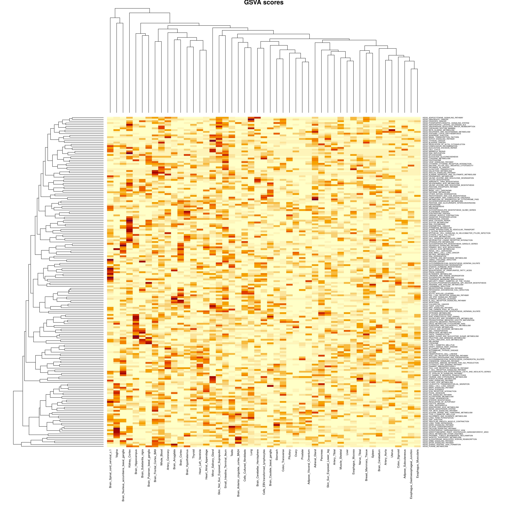

```{r, setup, include = FALSE}
knitr::opts_chunk$set(echo = FALSE)
```

### Load heritability data for four different methods: GSVA scores, PLAGE scores, singscores and z-scores.
```{r,warning=FALSE}
summaryg <- read.csv(file="../data/summaryg.csv",header = TRUE,row.names = 1)

summaryp <- read.csv(file="../data/summaryp.csv",header = TRUE,row.names = 1)

summarys <- read.csv(file="../data/summarys.csv",header = TRUE,row.names = 1)

summaryz <- read.csv(file="../data/summaryz.csv",header = TRUE,row.names = 1)
```
### Summary $h^2$ for each methods
There were `r ncol(summaryg)` tissues and `r nrow(summaryg)` pathways in the study.  
The number of missing values for GSVA scores: `r sum(is.na(summaryg))`  
The number of missing values for PLAGE scores: `r sum(is.na(summaryp))`  
The number of missing values for singscores: `r sum(is.na(summarys))`  
The number of missing values for z-scores: `r sum(is.na(summaryz))`  

### Compare heatmaps across four methods
  
  
  
  

### Calculate the correlation matrix between four methods using all the heritability data
```{r,warning=FALSE}
allg <- c()
for(i in 1:ncol(summaryg)){
  allg <- c(allg,as.matrix(summaryg[i]))
}
allp <- c()
for(i in 1:ncol(summaryg)){
  allp <- c(allp,as.matrix(summaryp[i]))
}
alls <- c()
for(i in 1:ncol(summaryg)){
  alls <- c(alls,as.matrix(summarys[i]))
}
allz <- c()
for(i in 1:ncol(summaryg)){
  allz <- c(allz,as.matrix(summaryz[i]))
}
all<-cbind(allp,allg,alls,allz)
corall<-cor(all, method = "pearson", use = "complete.obs")
rownames(corall)=c("GSVA scores", "PLAGE scores", "singscores", "z-scores")
colnames(corall)=c("GSVA scores", "PLAGE scores", "singscores", "z-scores")
corall
```
